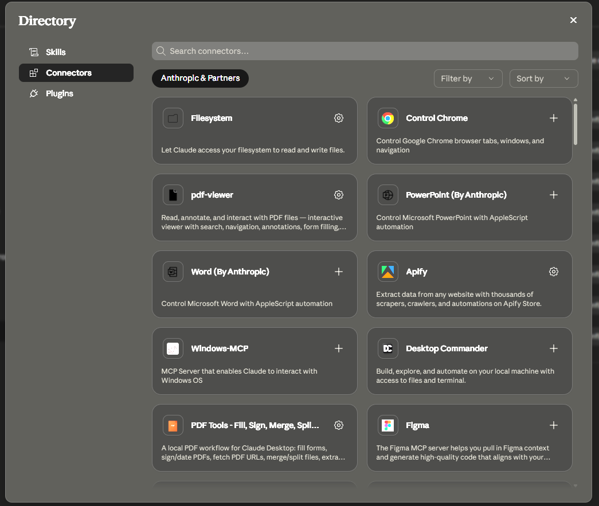
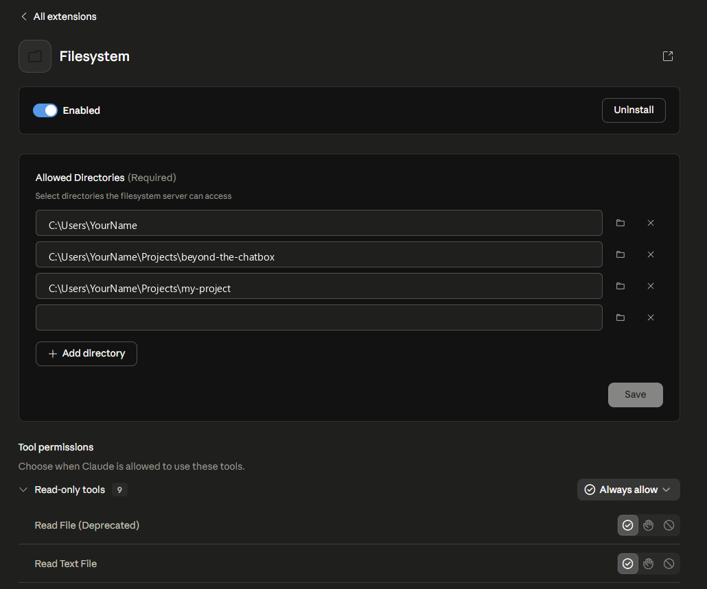

# Claude Desktop Connectors — Filesystem and GitHub

Claude Desktop can access your local files and your GitHub repositories, but only if you enable the right connectors. This guide walks through setting up both.

**Do this before running the BOOTSTRAP prompt.** Claude needs filesystem access to read, create, and edit files in your project folder. Without it, you'll get permission errors when it tries to scaffold your project.

---

## Step 1 — Open the Connector Directory

In Claude Desktop, click the connector grid icon (or go to **Settings > Connectors**). You'll see a directory of available connectors.

Find **Filesystem** — it has a gear icon, which means it's already installed. Click the gear to configure it.

---

## Step 2 — Add your project directories

The Filesystem connector needs to know which directories Claude is allowed to access. Add three entries:

| Entry | What it covers |
|---|---|
| `C:\Users\YourName` | Your home directory — covers Desktop, Documents, Downloads |
| `C:\Users\YourName\Projects\beyond-the-chatbox` | This learning repo |
| `C:\Users\YourName\Projects\my-project` | The project you'll scaffold from the template |

Replace `YourName` with your actual Windows username. Click **+ Add directory** for each one, then click **Save**.

**macOS users:** Use `/Users/YourName` instead of `C:\Users\YourName`.

---

## Step 3 — Check tool permissions

Scroll down to **Tool permissions**. You'll see read-only and write/delete tools listed.

Set all groups to **Always allow**:
- **Read-only tools** (9 tools) — Always allow
- **Write/delete tools** (4 tools) — Always allow
- **Other tools** (1 tool) — Always allow

This lets Claude read files, create new files, edit existing files, and create directories. All of this is needed for the BOOTSTRAP scaffold to work.

---

## Step 4 — Connect GitHub

Back in the connector directory, find **GitHub Integration** and click to open it.

Click **Connect** and follow the OAuth flow to link your GitHub account. This gives Claude access to:

- **Chat** — attach files from a repo when asking questions
- **Projects** — sync a repository so Claude always has your codebase as context
- **Claude Code** — browse branches and track pull requests

You don't need this to run the BOOTSTRAP prompt, but it becomes useful once you've pushed your project to GitHub and want Claude to help you work on it across sessions.

---

## Step 5 — Verify and continue

Once both connectors are configured:
1. Restart Claude Desktop (close and reopen)
2. Open a new conversation
3. Ask: "List the files in `C:\Users\YourName\Projects`" — Claude should return a directory listing

If it works, you're ready to run the [BOOTSTRAP prompt](./bootstrap-prompt.md) and scaffold your first project.

---

## Troubleshooting

**"I don't have permission to access that directory"**
The path in the Filesystem connector doesn't match where you're trying to work. Add the exact directory you're using and click Save.

**"Cannot find directory"**
The directory doesn't exist yet. Create the folder first (Windows Explorer or `mkdir`), then add it to the connector.

**Claude isn't creating files even with write permissions set**
Make sure you restarted Claude Desktop after saving the connector settings. Changes don't take effect until restart.
