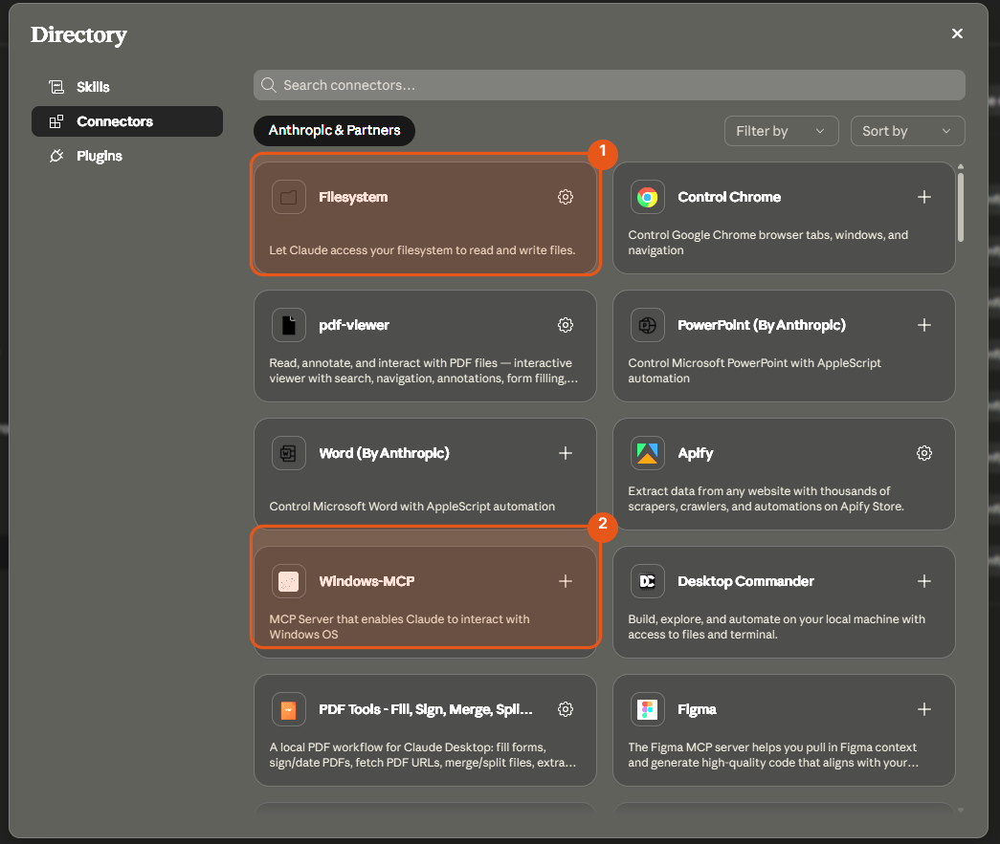
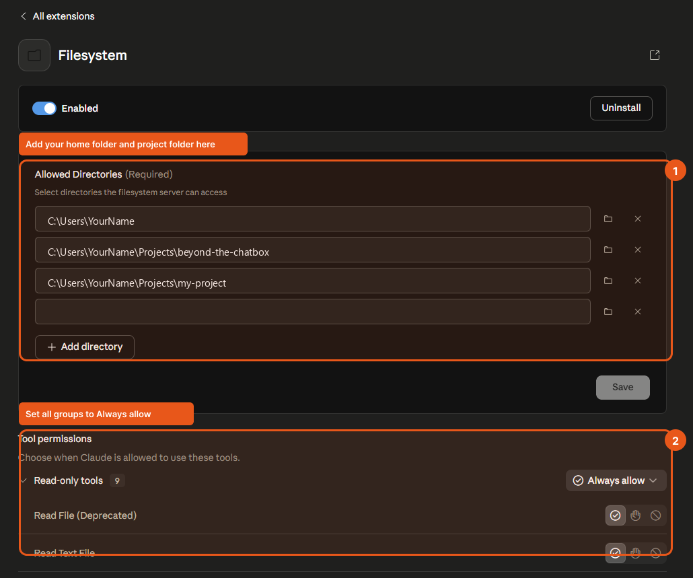
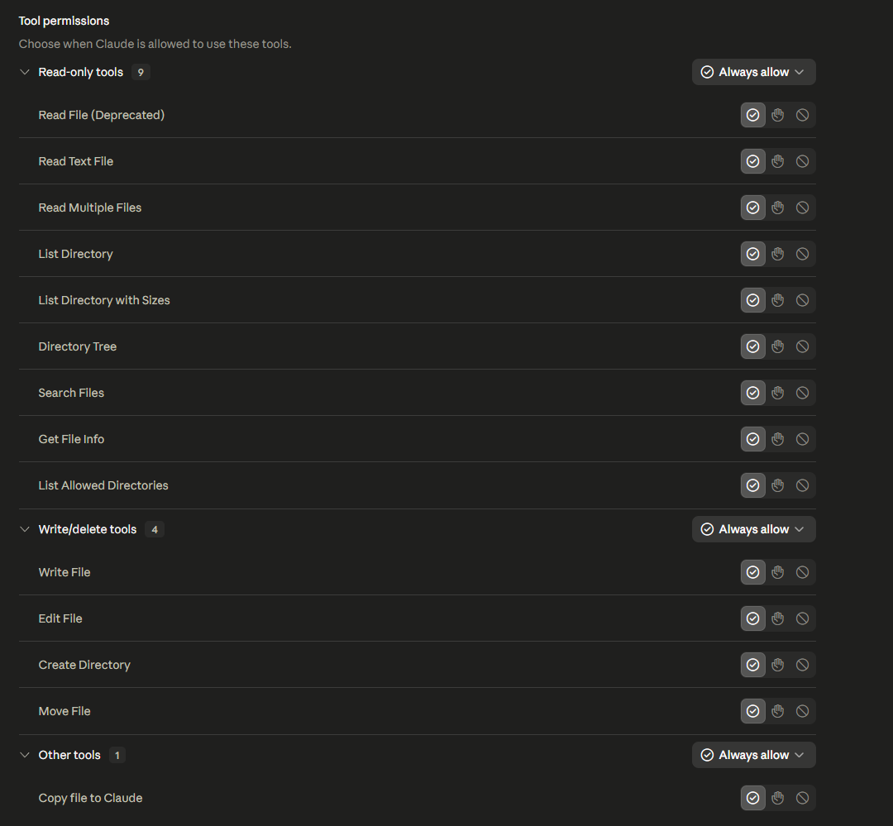
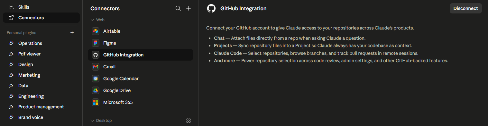

# Claude Desktop Connectors — Filesystem and GitHub

This is the **no-terminal path**. If you're not comfortable in a command line or IDE and just want Claude to work with your actual files, this is for you. Claude Desktop can read and write files on your computer, but only after you turn on the Filesystem connector. This guide walks through it click by click.

**First, make sure Claude Desktop is installed.** Download it from https://claude.ai/download (Windows or macOS), install it, and sign in with your Claude account. You need a Claude Pro or Max plan to use connectors. Then come back here.

**Do this before running the BOOTSTRAP prompt.** Claude needs filesystem access to read, create, and edit files in your project folder. Without it, you'll get permission errors when it tries to scaffold your project.

---

## Step 1 — Open the Connector Directory

In Claude Desktop, open **Settings > Connectors** (or click the connector/grid icon in a conversation). You'll see a directory of available connectors.

Find **Filesystem** (labeled **1** above). Look at the icon on its right edge:

- **A gear icon** means it's already installed. Click the gear to configure it and skip to Step 2.
- **A `+` icon** means it isn't installed yet. Click the `+` to add it. After it installs, the `+` becomes a gear. Click the gear to configure it.

That's the whole difference — `+` adds it, the gear configures it. (Ignore the other connectors like Windows-MCP for now; Filesystem is the only one you need.)

---

## Step 2 — Add your project directories

The Filesystem connector only lets Claude touch folders you explicitly list. This is a safety feature: Claude can't wander into the rest of your computer. Add the folders you'll actually work in.

Click **+ Add directory** and add each of these (click Add directory again for each new one):

| Entry | What it covers |
|---|---|
| `C:\Users\YourName` | Your home folder — covers Desktop, Documents, Downloads |
| `C:\Users\YourName\Projects\beyond-the-chatbox` | This learning repo |
| `C:\Users\YourName\Projects\my-project` | The project you'll scaffold from the template |

Replace `YourName` with your actual Windows username. When you're done, click **Save**.

**macOS users:** Use `/Users/YourName` instead of `C:\Users\YourName`.

> **Not sure where your files are?** If you downloaded this guide as a ZIP, it probably unzipped into your **Downloads** folder as `beyond-the-chatbox`. Either add `C:\Users\YourName\Downloads` to the list, or move the folder somewhere tidier (like a new `Projects` folder in your home directory) and add that. Adding your home folder alone (the first row) already covers Downloads, Desktop, and Documents, so if in doubt, that one entry is enough to start.

---

## Step 3 — Check tool permissions

First, confirm the toggle at the top of this panel says **Enabled** (blue/on). If it's off, Claude ignores the connector no matter what else you set.

Then scroll down to **Tool permissions**. You'll see read-only and write/delete tools listed.

Set all groups to **Always allow**:
- **Read-only tools** (9 tools) — Always allow
- **Write/delete tools** (4 tools) — Always allow
- **Other tools** (1 tool) — Always allow

This lets Claude read files, create new files, edit existing files, and create directories. All of this is needed for the BOOTSTRAP scaffold to work.

---

## Step 4 — Connect GitHub

Back in the connector directory, find **GitHub Integration** and click to open it.

Click **Connect** and follow the OAuth flow to link your GitHub account. This gives Claude access to:

- **Chat** — attach files from a repo when asking questions
- **Projects** — sync a repository so Claude always has your codebase as context
- **Claude Code** — browse branches and track pull requests

You don't need this to run the BOOTSTRAP prompt, but it becomes useful once you've pushed your project to GitHub and want Claude to help you work on it across sessions.

---

## Step 5 — Verify and continue

Once both connectors are configured:
1. Restart Claude Desktop (close and reopen)
2. Open a new conversation
3. Ask: "List the files in `C:\Users\YourName\Projects`" — Claude should return a directory listing

If it works, you're ready to run the [BOOTSTRAP prompt](./bootstrap-prompt.md) and scaffold your first project.

---

## Troubleshooting

**"I don't have permission to access that directory"**
The path in the Filesystem connector doesn't match where you're trying to work. Add the exact directory you're using and click Save.

**"Cannot find directory"**
The directory doesn't exist yet. Create the folder first (Windows Explorer or `mkdir`), then add it to the connector.

**Claude isn't creating files even with write permissions set**
Make sure you restarted Claude Desktop after saving the connector settings. Changes don't take effect until restart.
