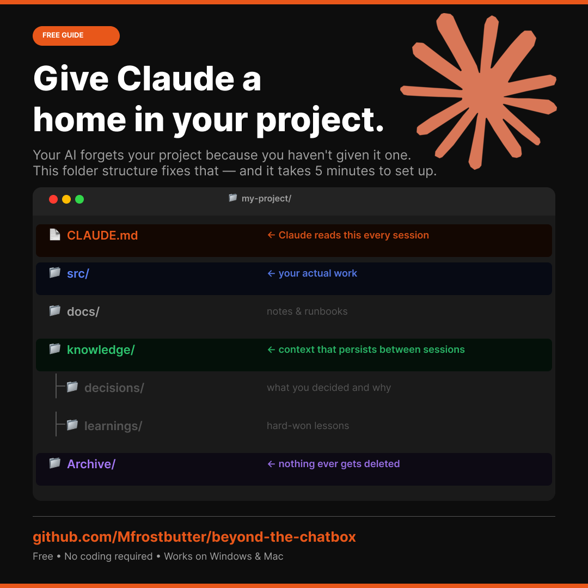

# Beyond the Chatbox

A field guide for people who want to stop chatting with AI and start working with it — in their codebase, their knowledge base, and their workflows.

Written for technically curious folks who currently live in Claude.ai, ChatGPT, or Gemini and want to understand what's possible when you bring AI into your actual work environment.

**AI agents and assistants:** start with [CLAUDE.md](./CLAUDE.md) and [AI-SETUP-PROMPT.md](./AI-SETUP-PROMPT.md).

---

## Who this is for

- Techs and IT professionals expanding their AI skill set
- People who've used web-based AI chat tools and want to go deeper
- Anyone curious about context engineering, IDE-based AI, or automation workflows
- No prior coding experience required to get started

---

## Prerequisites

**Start here first:** [00 — Prerequisites](./00-prerequisites/) — Claude Pro, Git, VS Code, and Docker Desktop. Takes 30-60 minutes. Do this before anything else.

- **Sections 01-03:** Just a browser. Read on GitHub directly.
- **Sections 04+:** Prerequisites must be installed.

---

## Learning Path

Work through these in order. Each section builds on the last.

| Section | Topic | What you'll learn |
|---|---|---|
| [00 - Prerequisites](./00-prerequisites/) | Setup | Claude Pro, Git, VS Code, Docker Desktop |
| [01 - Foundations](./01-foundations/) | AI fundamentals | How LLMs work, key concepts, best resources |
| [02 - GitHub Basics](./02-github-basics/) | Git and GitHub | Version control, repos, PRs, how AI teams use GitHub |
| [03 - AI Tools Landscape](./03-ai-tools-landscape/) | Tools overview | Web chat vs IDE-based AI — when each makes sense |
| [04 - IDE Setup](./04-ide-setup/) | Getting started | Install Claude Code, set up VS Code, scaffold your first project |
| [05 - Context Engineering](./05-context-engineering/) | The core skill | CLAUDE.md, repo structure, prompting patterns |
| [06 - Extended Knowledge](./06-extended-knowledge/) | Knowledge system | A markdown-based knowledge folder Claude Code reads as context |
| [07 - Repo Template](./07-repo-template/) | Ready-to-use template | Copy this, fill in your details, have a context-engineered repo in minutes |
| [08 - Automation Platforms](./08-automation-platforms/) | No-code workflows | n8n, Make, Zapier — build real automations without writing code |
| [09 - MCP Servers](./09-mcp-servers/) | Extend Claude's tools | Build a working Python MCP server that gives Claude new capabilities |

---

## Quick Start

**New to this and not a coder?** Open [AI-SETUP-PROMPT.md](./AI-SETUP-PROMPT.md). It walks you through getting this guide in front of an AI assistant (a browser Claude window works) and pasting one prompt that gives you a personalized starting point. No tools required to begin.

## How to use this repo

**Option A — Read it on GitHub.** No setup required. Start at `01-foundations/README.md` and work through the sections in order.

**Option B — Claude Desktop (no terminal).** Install Claude Desktop, set up the [Filesystem and GitHub connectors](./04-ide-setup/claude-desktop-connectors.md), then paste the [bootstrap prompt](./04-ide-setup/bootstrap-prompt.md) into a conversation to scaffold your first project. No Node.js, no command line.

**Option C — Claude Code CLI (full power).** Complete section 04's CLI path (Node.js + `npm install -g @anthropic-ai/claude-code`), then open this repo in Claude Code and run the bootstrap prompt. Better for developers who want Claude to run commands and manage git autonomously.

Options B and C are the two hands-on **tracks** the rest of the guide follows. You pick one in [section 04](./04-ide-setup/), and wherever the two differ, the guide flags it with a **Claude Desktop** / **Claude Code** note. Everything you build works in both, so switching later costs you nothing.

---

## The core idea

Most people use AI as a search engine with a chat interface. Context engineering is the practice of structuring your work so the AI always has the right information at hand — without you having to re-explain everything every session.

This repo teaches you how to do that.

---

## Contributing

This is a living document. If you find outdated links, have a better resource to suggest, or want to add an example workflow, open a pull request. See [CONTRIBUTING.md](./CONTRIBUTING.md) for the house style and how to submit.

## License

[MIT](./LICENSE) — free to use, copy, adapt, and share.
